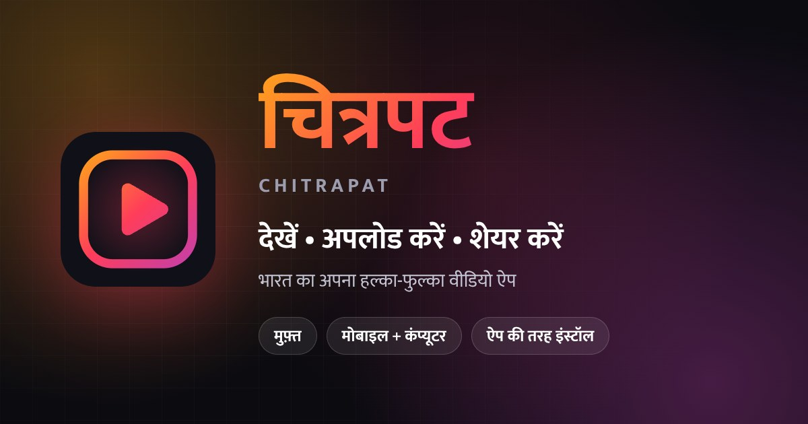

# चित्रपट (Chitrapat) 🎬



**भारत का अपना हल्का-फुल्का वीडियो ऐप।** इसमें आप वीडियो देख सकते हैं, अपलोड कर सकते हैं और शेयर कर सकते हैं।
यह मोबाइल, टैबलेट और कंप्यूटर तीनों पर चलता है। फ़ोन पर इसे ऐप की तरह इंस्टॉल भी किया जा सकता है (PWA)।

🔗 **लाइव लिंक:** https://u75622807-sketch.github.io/Chitrapat-New/

> 📋 इस रिपो में पहले क्या-क्या गड़बड़ियाँ थीं और वो कैसे ठीक हुईं, यह सब **[REPORT-HINDI.md](REPORT-HINDI.md)** में लिखा है।

---

## ✨ ख़ूबियाँ

| | |
|---|---|
| 🎬 **वीडियो प्लेयर** | "आगे देखें" लिस्ट, ऑटोप्ले, कीबोर्ड शॉर्टकट (K, F, M, ←/→) |
| ⬆️ **अपलोड** | Cloudinary पर अपलोड होता है। ड्रैग-ड्रॉप, प्रीव्यू, प्रगति %, स्पीड और बचा हुआ समय दिखता है। बीच में रोक भी सकते हैं। |
| 🔍 **खोज + श्रेणियाँ** | हिंदी या English में खोजें, और श्रेणी की चिप से फ़िल्टर करें |
| 👍 **लाइक / ⏰ बाद में देखें / 🕘 इतिहास** | आपकी लाइब्रेरी इसी डिवाइस में सेव रहती है |
| 🔔 **सब्सक्राइब + चैनल पेज** | पसंदीदा चैनलों के वीडियो एक जगह मिलते हैं |
| 🔗 **शेयर + QR कोड** | लैपटॉप पर QR दिखाएँ, सामने वाला फ़ोन से स्कैन करे और वीडियो तुरंत खुल जाए |
| 📱 **PWA** | ऐप की तरह इंस्टॉल होता है, ऑफ़लाइन भी खुलता है, और होम-स्क्रीन पर शॉर्टकट मिलते हैं |
| 🌗 **डार्क / लाइट थीम** | आपकी पसंद याद रखी जाती है |
| 🧪 **डेमो मोड** | सर्वर (Firebase) न मिले, तब भी ऐप डेमो वीडियो के साथ चलता है, यानी कहीं भी दिखाया जा सकता है |
| 🔒 **सुरक्षित** | XSS से बचाव (यूज़र का डेटा कभी भी HTML की तरह नहीं चलता), सिर्फ़ https लिंक, और सख़्त Firestore Rules |

कोई फ़्रेमवर्क या बिल्ड-स्टेप नहीं है। सिर्फ़ HTML + CSS + JavaScript (ES Modules) इस्तेमाल हुआ है, इसलिए ऐप बहुत हल्का और तेज़ है।

---

## 🚀 अपने कंप्यूटर पर चलाएँ

```bash
# तरीका 1: Python से
python -m http.server 8080

# तरीका 2: Node.js से
npx http-server -c-1 -p 8080 .
```

फिर ब्राउज़र में **http://localhost:8080** खोलें।

> ⚠️ `index.html` को डबल-क्लिक करके (`file://` से) न खोलें। ES Modules और Service Worker को चलाने के लिए एक छोटा सर्वर ज़रूरी है।

---

## 🌐 GitHub Pages पर लाइव करें

1. सारा कोड `main` ब्रांच में होना चाहिए (Pull Request को merge करें)।
2. GitHub पर रिपो की **Settings → Pages** में जाएँ। वहाँ Source: *Deploy from a branch* और Branch: `main`, फ़ोल्डर: `/ (root)` चुनकर **Save** दबाएँ।
3. 1–2 मिनट बाद साइट यहाँ लाइव हो जाएगी: https://u75622807-sketch.github.io/Chitrapat-New/

### अपना डोमेन लगाना हो (वैकल्पिक)

पहले `www.chitrapat.gt.tc` के लिए एक `CNAME` फ़ाइल थी, पर वो डोमेन GitHub की तरफ़ पॉइंट ही नहीं कर रहा था (जाँच रिपोर्ट देखें)। सही तरीका यह है:

1. अपने डोमेन प्रोवाइडर के DNS में एक रिकॉर्ड जोड़ें: **Type:** `CNAME`, **Name:** `www`, **Value:** `u75622807-sketch.github.io`
2. GitHub में **Settings → Pages → Custom domain** में `www.chitrapat.gt.tc` लिखकर Save करें (GitHub ख़ुद `CNAME` फ़ाइल बना देगा)।
3. DNS चेक पास होने के बाद **Enforce HTTPS** पर टिक करें।
4. `config.js` में `siteUrl` और `index.html` में `og:url` / `og:image` वाले लिंक नए डोमेन से बदल दें।

---

## 🔥 Firebase सेटअप (सिर्फ़ एक बार)

1. **Anonymous लॉगिन चालू करें:** Firebase Console → Authentication → Sign-in method → **Anonymous** → Enable।
2. **Security Rules लगाएँ:** Firestore Database → Rules में इस रिपो की [`firestore.rules`](firestore.rules) का पूरा कोड पेस्ट करें और **Publish** दबाएँ।
3. **API key पर पाबंदी लगाएँ (सलाह दी जाती है):** Google Cloud Console → APIs & Services → Credentials → *Browser key* खोलें। *Application restrictions* में **Websites** चुनें और ये जोड़ें:
   - `https://u75622807-sketch.github.io/*`
   - `http://localhost:8080/*` (कंप्यूटर पर टेस्ट करने के लिए)
4. *(आगे Google Login जोड़ना हो तो)* Authentication → Settings → Authorized domains में `u75622807-sketch.github.io` जोड़ें।

> ℹ️ `config.js` में दिख रहा Firebase config "पब्लिक" होता है। इसे छुपाने की ज़रूरत नहीं है। सुरक्षा Rules और API-key की पाबंदी से होती है।

## ☁️ Cloudinary सेटअप (सिर्फ़ एक बार)

Cloudinary Console → Settings → Upload → Upload presets में जाकर **`metube_final_video`** (Unsigned) खोलें और ये सेट करें:

- **Allowed formats:** `mp4, webm, mov, mkv`
- **Max file size:** 100 MB
- **Folder:** `chitrapat`
- ⚠️ Unsigned preset का मतलब है कि जो भी आपका कोड देखे, वो इस preset से अपलोड कर सकता है। इसलिए ऊपर की सीमाएँ ज़रूर लगाएँ। API **Secret** कभी भी फ़्रंटएंड कोड में न डालें।

---

## ⚙️ सेटिंग्स: [`config.js`](config.js)

| सेटिंग | मतलब |
|---|---|
| `firebase` | आपके Firebase प्रोजेक्ट का web config |
| `firestoreAppId` | डेटा का पाथ `artifacts/<id>/public/data/videos`। इसे बदलने पर पुराने वीडियो नहीं दिखेंगे। |
| `cloudinary` | `cloudName` और `uploadPreset` |
| `maxUploadMB` | अपलोड की अधिकतम साइज़ (MB में) |
| `showDemoVideos` | `true` करने पर आपके वीडियो के साथ 10 डेमो वीडियो भी दिखते हैं। `false` करने पर सिर्फ़ आपके वीडियो दिखेंगे। |
| `analyticsId` | Google Analytics ID। `''` रखने पर Analytics बंद रहेगा। |

---

## 📁 फ़ाइलें

```
index.html          ← ऐप का ढाँचा (हेडर, साइडबार, नीचे का मेन्यू, आइकन)
style.css           ← पूरा डिज़ाइन (डार्क/लाइट थीम, मोबाइल/डेस्कटॉप)
app.js              ← शुरुआत: राउटर, सर्च, थीम, ऑफ़लाइन
config.js           ← सारी सेटिंग्स
js/
  pages.js          ← सारे पेज (होम, ट्रेंडिंग, प्लेयर, अपलोड, लाइब्रेरी…)
  ui.js             ← कार्ड, थंबनेल, टोस्ट, QR, पॉप-अप
  backend.js        ← Firebase + Cloudinary
  store.js          ← डेटा और आपकी पसंद (localStorage)
  utils.js          ← फ़ॉर्मैटिंग, URL-सुरक्षा, Cloudinary थंबनेल
  pwa.js            ← इंस्टॉल + Service Worker
  demo-data.js      ← डेमो वीडियो और श्रेणियाँ
  vendor/qrcode.min.js ← QR कोड लाइब्रेरी (MIT)
sw.js               ← Service Worker (ऑफ़लाइन)
manifest.json       ← PWA की जानकारी (नाम, आइकन, शॉर्टकट)
icons/              ← ऐप आइकन, favicon, शेयर-प्रीव्यू इमेज
assets/fonts/       ← Mukta फ़ॉन्ट (हिंदी + English) + लाइसेंस
assets/original-logo-q.png ← आपकी पुरानी "Q" लोगो इमेज (पहले "icons" नाम की फ़ाइल थी)
firestore.rules     ← Firebase Security Rules
404.html            ← ग़लत लिंक पर दिखने वाला पेज
REPORT-HINDI.md     ← जाँच रिपोर्ट: गड़बड़ियाँ और उनका हल
```

---

## 🙏 आभार (थर्ड-पार्टी)

- **Mukta फ़ॉन्ट**: © Ek Type, [SIL Open Font License 1.1](assets/fonts/OFL.txt)
- **Feather Icons**: © Cole Bemis, MIT License
- **qrcode-generator**: © Kazuhiko Arase, MIT License
- **डेमो वीडियो**: Cloudinary के सार्वजनिक sample वीडियो (`res.cloudinary.com/demo`)। असली लॉन्च से पहले इन्हें अपने वीडियो से बदलें या `showDemoVideos: false` कर दें।

---

## 🛑 कानूनी नोटिस (LEGAL NOTICE)

इस रिपॉजिटरी का मूल कोड (ऊपर "आभार" में लिखी थर्ड-पार्टी चीज़ों को छोड़कर) कॉपीराइट द्वारा सुरक्षित है।

**© 2025–2026 Utkarsh Maurya। ALL RIGHTS RESERVED.**

लेखक की स्पष्ट लिखित अनुमति के बिना इस कोड को किसी भी रूप में **कॉपी करना, दोबारा इस्तेमाल करना (reuse), बाँटना या किसी दूसरे प्रोजेक्ट में इस्तेमाल करना मना है (PROHIBITED)**।
